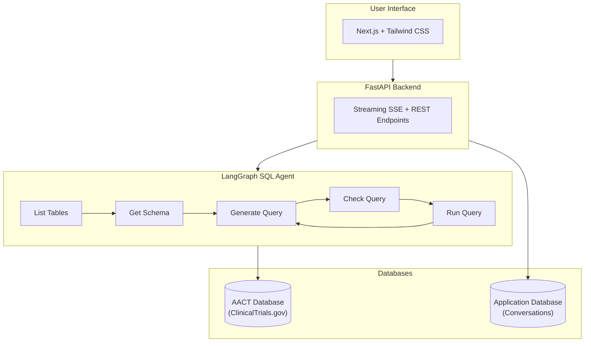
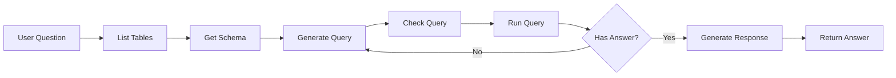

# Clinical Trials Text-to-SQL Agent

A natural language interface for querying the [AACT (Aggregate Analysis of ClinicalTrials.gov)](https://aact.ctti-clinicaltrials.org/) database. Ask questions in plain English and get answers powered by SQL queries generated by an AI agent.

## Architecture

```
┌─────────────────────────────────────────────────────────────────────────────┐
│                              User Interface                                  │
│                         (Next.js + Tailwind CSS)                            │
└─────────────────────────────────────────────────────────────────────────────┘
                                      │
                                      ▼
┌─────────────────────────────────────────────────────────────────────────────┐
│                              FastAPI Backend                                 │
│                    (Streaming SSE + REST Endpoints)                         │
└─────────────────────────────────────────────────────────────────────────────┘
                                      │
                                      ▼
┌─────────────────────────────────────────────────────────────────────────────┐
│                           LangGraph SQL Agent                                │
│  ┌───────────┐   ┌───────────┐   ┌───────────┐   ┌───────────┐             │
│  │   List    │──▶│   Get     │──▶│ Generate  │──▶│   Check   │             │
│  │  Tables   │   │  Schema   │   │   Query   │   │   Query   │             │
│  └───────────┘   └───────────┘   └───────────┘   └─────┬─────┘             │
│                                        ▲               │                    │
│                                        │               ▼                    │
│                                        │         ┌───────────┐             │
│                                        └─────────│    Run    │             │
│                                                  │   Query   │             │
│                                                  └───────────┘             │
└─────────────────────────────────────────────────────────────────────────────┘
                                      │
                    ┌─────────────────┴─────────────────┐
                    ▼                                   ▼
┌─────────────────────────────┐       ┌─────────────────────────────┐
│      AACT Database          │       │    Application Database     │
│  (ClinicalTrials.gov Data)  │       │  (Conversation Persistence) │
│      PostgreSQL             │       │        PostgreSQL           │
└─────────────────────────────┘       └─────────────────────────────┘
```



## Agent Workflow



The LangGraph agent follows a structured workflow to convert natural language questions into SQL:

1. **List Tables** - Discovers available tables in the AACT database
2. **Get Schema** - LLM selects relevant tables and retrieves their schemas
3. **Generate Query** - Creates a SQL query based on the question and schema
4. **Check Query** - Validates the query for common SQL mistakes
5. **Run Query** - Executes the validated query against the database
6. **Generate Response** - Formulates a natural language answer from results

## AACT Database

This project uses the **AACT (Aggregate Analysis of ClinicalTrials.gov)** database, a publicly available relational database containing all information from ClinicalTrials.gov.

- **Database Host**: `aact-db.ctti-clinicaltrials.org`
- **Documentation**: https://aact.ctti-clinicaltrials.org/
- **Schema Reference**: https://aact.ctti-clinicaltrials.org/data_dictionary

Key tables include: `studies`, `conditions`, `interventions`, `outcomes`, `facilities`, `sponsors`, and many more.

> **Note**: Only the deployer needs AACT credentials. End users of the deployed application do not need to register - the backend queries AACT on their behalf using a single service account.

## Features

- **Natural Language Queries**: Ask questions like "How many breast cancer trials are recruiting?"
- **Real-time Streaming**: See the agent's progress and SQL generation in real-time
- **Conversation History**: Continue previous conversations with full context
- **SQL Visualization**: View the generated SQL queries with syntax highlighting
- **Export Options**: Export conversations as PDF, Markdown, CSV, or JSON
- **Custom API Keys**: Use your own OpenAI API key if needed

## Tech Stack

**Backend**
- Python 3.11+
- FastAPI (async REST API with SSE streaming)
- LangGraph (agent orchestration)
- LangChain (SQL tools and LLM integration)
- PostgreSQL (conversation persistence via Alembic)
- OpenAI GPT-5.2 (LLM)

**Frontend**
- Next.js 15 (React framework)
- Tailwind CSS (styling)
- TypeScript
- Radix UI (accessible components)

## Local Development

### Prerequisites

- Python 3.11+
- Node.js 18+ or Bun
- PostgreSQL (for conversation persistence)
- AACT database credentials (free, [register here](https://aact.ctti-clinicaltrials.org/users/sign_up))
- OpenAI API key

> These credentials are only needed for development/deployment. End users don't need any accounts.

### Backend Setup

```bash
# Install dependencies
uv sync

# Copy environment file and fill in values
cp .env.example .env

# Create local database for conversation persistence
createdb clinical_trials_app

# Run migrations
cd src/clinical_trials_agent
uv run alembic upgrade head
cd ../..

# Start the API server
uv run uvicorn clinical_trials_agent.api.main:app --reload
```

### Frontend Setup

```bash
cd ui

# Install dependencies
bun install

# Start development server
bun run dev
```

Visit http://localhost:3000 to use the application.

### Environment Variables

See `.env.example` for all configuration options:

| Variable | Description |
|----------|-------------|
| `DB_USER` / `DB_PASSWORD` | AACT database credentials |
| `OPENAI_API_KEY` | OpenAI API key for GPT-4o |
| `APP_DB_*` | Local PostgreSQL for conversation storage |
| `LANGSMITH_API_KEY` | Optional: LangSmith tracing |

## Deployment

### Backend (Railway)

The backend is configured for automatic deployment to Railway via GitHub Actions.

1. Create a Railway project and add a PostgreSQL database
2. Set the environment variables in Railway dashboard
3. Push to `main` branch to trigger deployment

### Frontend (Vercel)

The frontend is configured for automatic deployment to Vercel via GitHub Actions.

1. Import the repository in Vercel
2. Set `NEXT_PUBLIC_API_URL` to your Railway backend URL
3. Push to `main` branch to trigger deployment

## Testing

```bash
# Backend tests
uv run pytest

# Backend linting
uv run ruff check .

# Frontend linting
cd ui && bun run lint

# E2E tests
cd ui && bun run test:e2e
```

## License

MIT
